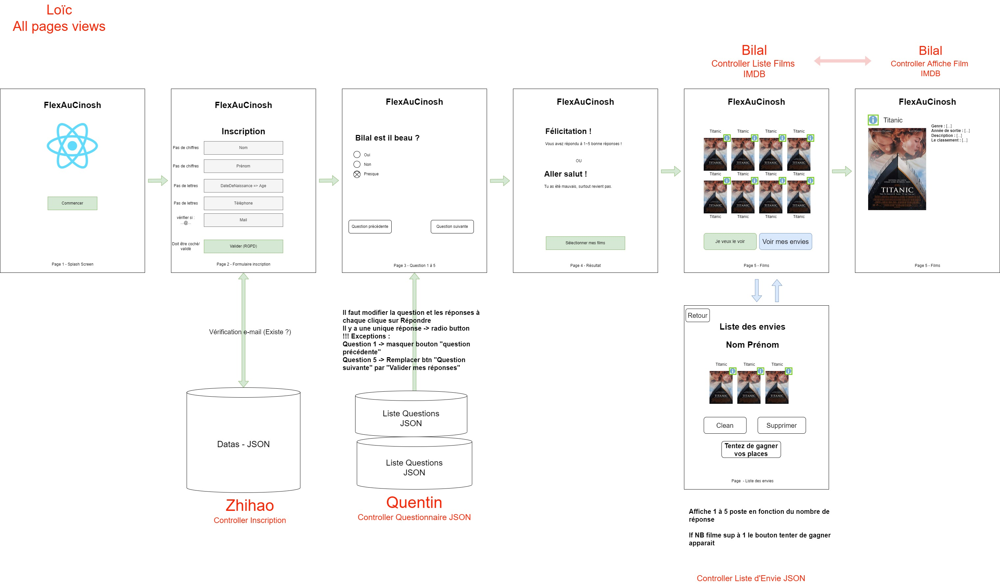
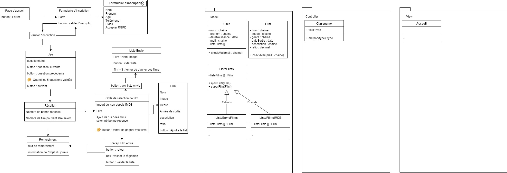

# Projet React - FlexÔCinosh
## Créer un jeux concours sur le cinéma :

## Collaborateurs - Estimation des membres
- __5/5__ - Maxence HENNEKEIN : maxence.hennekein@edu.esiee-it.fr
- __4/5__ - Bilal MOUHIB : bilal.mouhib@edu.esiee-it.fr
- __4/5__ - Chen ZHIHAO : zhihao.chen@edu.esiee-it.fr
- __5/5__ - Loïc DUMAY : loic.dumay@edu.itescia.fr
- __3/5__ - Quentin NARDY : quentin.nardy@edu.itescia.fr

## Langages du projst
- ReactJS (inclus HTML / CSS / JS / JSX)

## Librairies
- Axios :
  - axios - v0.25.0"
- Phone Input :
  - react-phone-number-input - v3.1.44"
- React Boostrap :
  - bootstrap - v5.1.3"
  - react-bootstrap - v2.1.1"
- React (dépendances propre de React) :
  - react - v17.0.2"
  - react-scripts - v5.0.0"
  - web-vitals - v2.1.4"
- React Router :
  - react-dom - v17.0.2"
  - react-router-dom - v6.2.1"
- React SASS for use SCSS :
  - sass - v1.49.0"

## Schémas - IHM et UML

## IHM

### UML __(non terminé)__

